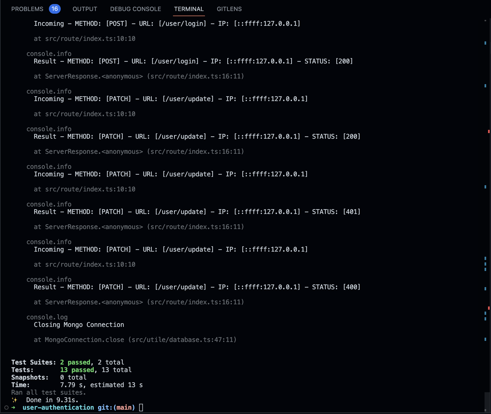
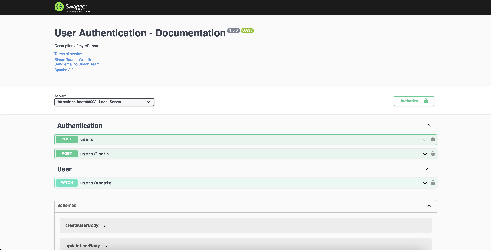

# README Generator   
 
 <div align="center">
 
    
  
</div>

# User Auth Description
A user authentication REST API where a user can register, login and update the account information. Optionally create a simple frontend with forms that interact with the API and a secure page that only is accessible for users that have logged in


  ### Requirement: 
  
  * [JavaScript](https://www.javascript.com/)
  * [TypeScript](https://www.typescriptlang.org/)
  * [Node JS](https://nodejs.org/en/)
  * [Express](https://expressjs.com/)
  * [MongoDB](https://www.mongodb.com/)
  * [Yarn](https://yarnpkg.com/)


  ## Table of Contents

  * [Installation](#installation)
  * [Usage](#usage)
  * [API Documentation](#api-documentation)
  * [Pattern](#pattern used)
  * [License](#license)
  * [Nice to have](#nice-to-have)
  * [Screenshots](#screenshots)
  
  ***

## Installation

To run this program simply clone the repo from GitHub using the following command, 

```
git clone https://github.com/syflex/user-authentication.git
```


## Usage
### Running the app

To run the app, you need to first build the app with `npx tsc` or `npx tsc --watch` then can use the command `yarn dev` or `npm run dev` in the terminal. This will start the server and you can then use the API endpoints to interact with the app.

### Building the app
```bash
npx tsc
```

#### Development
```bash
$ yarn start
```
#### watch mode
```bash
$ yarn dev
```

#### unit tests
```bash
$ yarn test
```

#### lint checks
```bash
$ yarn lint:check
```

#### lint fix
```bash
$ yarn lint:fix
```

## API Documentation
The API documentation is available withing the application at the following endpoint `{{base_url}}/documentation` or you can view it [here](https://documenter.getpostman.com/view/3671953/2s8YYCtQjk)

To view the API documentation you need to have application running on your local machine. You can run the application by following the steps in the [Installation](#installation) section above.


## Pattern used

* [MVC](https://en.wikipedia.org/wiki/Model%E2%80%93view%E2%80%93controller)
  MVC is a software design pattern that separates an application into three main logical components: the model, the view, and the controller. we eliminate view as we are only creating API's. Each of these components are built to handle specific development aspects of an application.

  The following structure rules:
  Rule 1: Arrange files around features.
  Rule 3: Place test in a separate folder for easy access.
  Rule 4: Place scripts and utility in a utile folder. :wink: :wink: can we done better hahaha
  Rule 5: service layer is use for business logic.
  Rule 6: controller layer is use for request and response.
  Rule 7: model layer is use for database schema.
  Rule 8: repository layer is use for database query.

  
## License
<details>
  
  
  <summary>GNU LESSER GENERAL PUBLIC LICENSE</summary>
  
  > Version 3, 29 June 2007
  > 
  > Copyright (C) 2007 Free Software Foundation, Inc. <https://fsf.org/>
  >
  > __Everyone is permitted to copy and distribute verbatim copies__
  > __of this license document, but changing it is not allowed.__
  > 
  > 
  > This version of the GNU Lesser General Public License incorporates
  > the terms and conditions of version 3 of the GNU General Public
  > License, supplemented by the additional permissions listed below.
  > 
  > 0. Additional Definitions.
  > 
  > Library.
  </details>


## Nice to have
* [ ] Add a frontend to the application
* [ ] Websocket integration
* [ ] Both unit and integration tests
* [ ] Enforce dto validation with class-validator automatically

## Screenshots

### Test


### API Documentation


  >Email: syflex360@gmail.com 